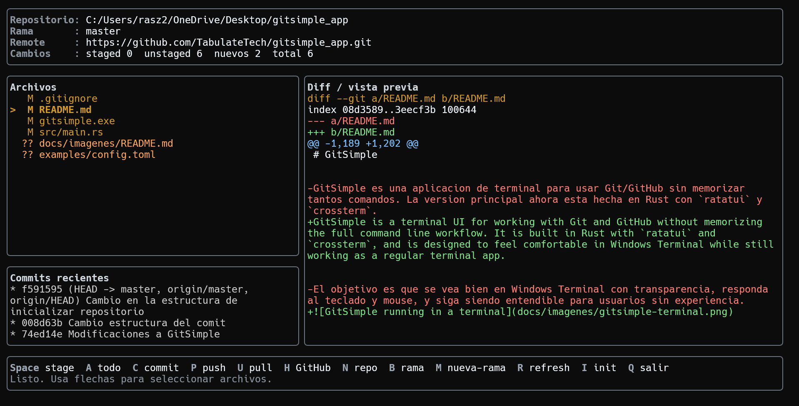

# GitSimple-Terminal

GitSimple-Terminal is a lightweight terminal UI for working with Git and GitHub without memorizing the full command-line workflow.

It is built in Rust with `ratatui` and `crossterm`, and is designed to feel comfortable in Windows Terminal while still working as a regular terminal application.



## Overview

GitSimple-Terminal provides a focused Git workflow from the terminal:

- Review changed, staged, unstaged, and untracked files.
- Stage or unstage one file at a time.
- Stage all pending changes.
- Create commits with a title and optional description.
- Push and pull from the configured remote.
- Initialize repositories.
- Switch and create branches.
- Preview file diffs and commit details.
- Create GitHub repositories using GitHub CLI.
- Delete local Git metadata or GitHub repositories with guarded confirmations.
- Customize colors and keyboard shortcuts using a TOML config file.

## Features

| Feature | Description |
|---|---|
| File status | Shows modified, staged, unstaged, and untracked files. |
| Staging workflow | Allows staging/unstaging individual files or staging everything at once. |
| Commit creation | Supports commit title and optional body/description. |
| GitHub integration | Creates repositories with GitHub CLI, sets `origin`, and pushes the project. |
| Repository deletion | Deletes local `.git`, the GitHub repository, or both after explicit confirmation. Local deletion keeps project files. |
| Branch tools | Switch existing branches or create new branches from the app. |
| Commit preview | Shows recent commits and previews the selected commit. |
| Diff navigation | Opens file or commit previews in a navigable view. |
| Safe confirmations | Confirms actions such as push, pull, branch creation, and repository creation. |
| Theme configuration | Supports named colors, RGB values, ANSI colors, and hex colors. |

## Project Structure

| Path | Purpose |
|---|---|
| `src/main.rs` | Application entry point and startup checks. |
| `src/model.rs` | Shared data types and app state structs. |
| `src/app.rs` | Core GitSimple-Terminal workflow logic. |
| `src/events.rs` | Keyboard, mouse, paste, and prompt editing behavior. |
| `src/ui.rs` | Terminal rendering and dialog layout. |
| `src/git.rs` | Git and GitHub command helpers. |
| `src/config.rs` | TOML config, themes, colors, and shortcuts. |
| `src/terminal.rs` | Terminal setup, cleanup, and event loop. |
| `src/tests.rs` | Unit tests for parsing, editing, preview, and Git helpers. |


## Requirements

Before using GitSimple-Terminal, make sure the following tools are installed:

| Tool | Required | Purpose |
|---|---:|---|
| Git | Yes | Required for all repository operations. |
| Rust + Cargo | Yes, for building from source | Used to compile the application. |
| GitHub CLI (`gh`) | Optional | Required only for GitHub repository creation/deletion from inside GitSimple-Terminal. |
| Windows Terminal | Recommended | Provides the best visual experience on Windows. |

Check the required tools:

```powershell
git --version
cargo --version
gh --version
```

Authenticate GitHub CLI before using the GitHub workflow:

```powershell
gh auth login
```

Windows installation details are available in `docs\installation-windows.md`.

## Quick Start

Clone the repository:

```powershell
git clone https://github.com/TabulateTech/gitsimple-terminal.git
cd gitsimple-terminal
```

Run the app in release mode:

```powershell
cargo run --release
```

On Windows, you can also use the optional helper script:

```powershell
.\scripts\run_gitsimple.bat
```

Install `gitsimple` as a user command on Windows:

```powershell
powershell -ExecutionPolicy Bypass -File .\scripts\install_gitsimple_rust.ps1
```

Build a release binary:

```powershell
cargo build --release
```

The executable will be generated at:

```text
target\release\gitsimple.exe
```

## Running GitSimple-Terminal

Open GitSimple-Terminal inside any Git project folder:

```powershell
gitsimple
```

Or, while developing from this repository:

```powershell
cargo run --release
```

## Keyboard Shortcuts

| Key | Action |
|---|---|
| `Up / Down` | Select a file or commit, depending on the active panel. |
| `Tab` | Switch focus between the files panel and the commits panel. |
| `Space` | Stage or unstage the selected file. |
| `A` | Stage all changes. |
| `C` | Create a commit. |
| `P` | Push to the configured remote. |
| `U` | Pull from the configured remote. |
| `L` | Align the local branch with GitHub using rebase, then push. GitSimple-Terminal suggests this when GitHub and the local branch are out of sync. |
| `H` | Create a GitHub repository and push the current project. |
| `X` | Delete the local repo, GitHub repo, or both. Local deletion keeps files and removes only `.git`. |
| `I` | Run `git init` in the current folder. |
| `B` | Switch to an existing branch. |
| `M` | Create a new branch. |
| `R` | Refresh repository information. |
| `Enter` | Navigate the selected file or commit preview. |
| `Delete` | Delete the latest commit when the commits panel is focused. |
| `Esc` | Leave preview navigation or cancel dialogs. |
| `?` | Open quick help. |
| `Q` | Quit GitSimple-Terminal. |

## Commit Preview

When the commits panel is focused, GitSimple-Terminal automatically previews the selected commit.

Use:

```text
Up / Down    Select another commit
Enter        Navigate the commit preview
Esc          Return to normal mode
Delete       Delete the latest commit, if it is selected
```

The delete action is intentionally limited to the most recent commit to reduce the risk of changing older history accidentally.

## Confirmations

Potentially important actions show a confirmation dialog before running.

```text
Y / Enter    Confirm
N / Esc      Cancel
```

Examples of actions that require confirmation:

- Stage all changes.
- Push.
- Pull.
- Initialize a repository.
- Create a GitHub repository.
- Delete a local or GitHub repository.
- Create a new branch.
- Delete the latest commit.

## GitHub Repository Creation

Press `H` to start the GitHub workflow:

1. Enter the repository name.
2. Choose visibility.
3. Confirm the action.

GitSimple-Terminal runs:

```powershell
gh repo create
```

Then it connects `origin` and pushes the current project.

By default, the private option is recommended for projects that are still in development.

## Configuration

GitSimple-Terminal creates a user config file on first run:

```text
~\.gitsimple\config.toml
```

A polished example is available at:

```text
examples\config.toml
```

Example theme:

```toml
[theme]
border = "#6e7681"
title = "#d0d7de"
text = "#f0f6fc"
command_key = "#9da7b3"
muted = "#8b949e"
selected = "#d29922"
staged = "#7ee787"
unstaged = "#d29922"
untracked = "#ffa657"
error = "#ff7b72"
success = "#7ee787"
diff_add = "#7ee787"
diff_remove = "#ff7b72"
diff_meta = "#79c0ff"
```

Supported color formats:

| Format | Example |
|---|---|
| Named colors | `red`, `green`, `blue`, `cyan`, `white` |
| Gray aliases | `gray`, `grey`, `dark_gray` |
| Bright variants | `bright_red`, `light_blue`, `bright_green` |
| Common names | `orange`, `pink`, `brown`, `lime`, `teal`, `navy`, `violet`, `indigo` |
| Hex RGB | `#7ee787` |
| RGB function | `rgb(126,231,135)` |
| ANSI palette | `ansi(46)` |

Restart GitSimple-Terminal after editing the config file.

## Windows Helper Scripts

Windows helper scripts live in `scripts/`:

| Script | Purpose |
|---|---|
| `scripts\run_gitsimple.bat` | Build if needed and run GitSimple-Terminal from the repository. |
| `scripts\build_gitsimple.bat` | Build the release executable into `target\release`. |
| `scripts\install_gitsimple_rust.ps1` | Install `gitsimple.exe` into `%LOCALAPPDATA%\GitSimple-Terminal\bin` and add it to the user PATH. |
| `scripts\install_gitsimple_rust.bat` | Batch wrapper for the PowerShell installer. |

They are not required to build or run the project. The canonical Rust workflow is:

```powershell
cargo run --release
cargo build --release
```

Generated binaries such as `gitsimple.exe` are intentionally not committed to the repository. They should be published through GitHub Releases when needed.

## Development

Format the code:

```powershell
cargo fmt
```

Run tests:

```powershell
cargo test
```

Build a release version:

```powershell
cargo build --release
```

Or use the Windows helper:

```powershell
.\scripts\build_gitsimple.bat
```

Run a quick check:

```powershell
gitsimple --check
```

## Recommended Release Workflow

Before pushing, review the current status:

```powershell
git status
```

Stage your changes:

```powershell
git add -A
```

Create a commit:

```powershell
git commit -m "chore: prepare repository for public release"
```

Push the current branch:

```powershell
git push origin $(git branch --show-current)
```

## License

GitSimple-Terminal is licensed under the MIT License. See `LICENSE`.
